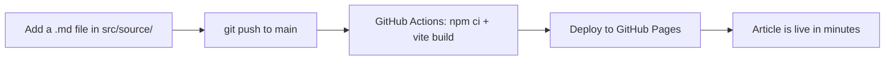

Welcome to **LLM Wiki** — a file-driven knowledge base. This article is a sample: it lives at `src/source/welcome.md` and is picked up automatically by the build pipeline.

## How new articles go live



## Write in Markdown

Every article starts with YAML frontmatter:

```markdown
---
title: "Article Title"
category: Guide
date: 2026-09-15 00:00:00
tags: [LLM, AI]
summary: "Short description shown in the list."
---
```

Supported syntax includes GFM tables, KaTeX math, Mermaid diagrams, syntax highlighting, and Lucide icons.

| Feature | Supported |
| --- | --- |
| Tables (GFM) | Yes |
| Math (KaTeX) | Yes |
| Diagrams (Mermaid) | Yes |
| Code highlighting | Yes |
